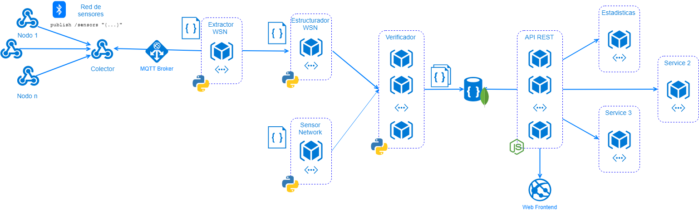
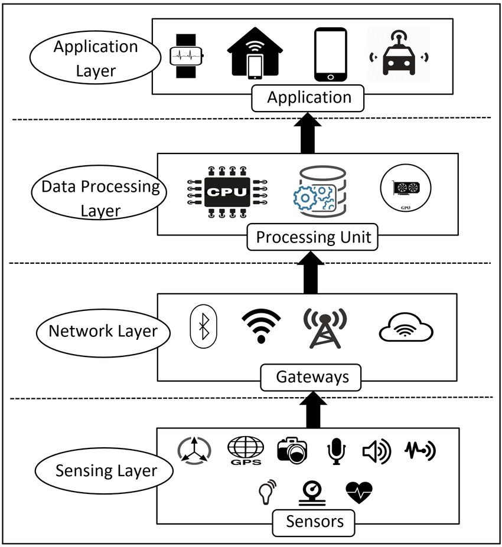
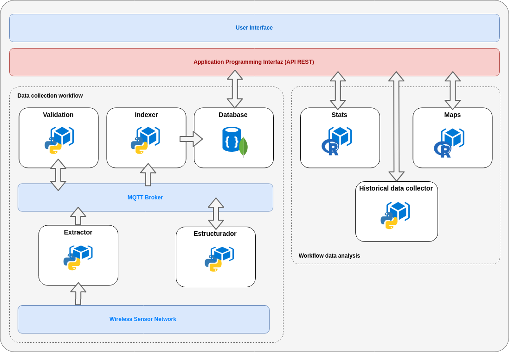
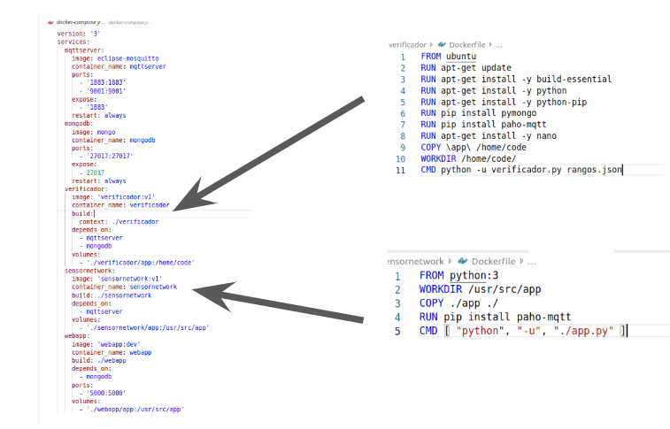
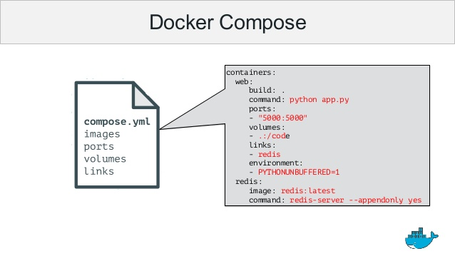
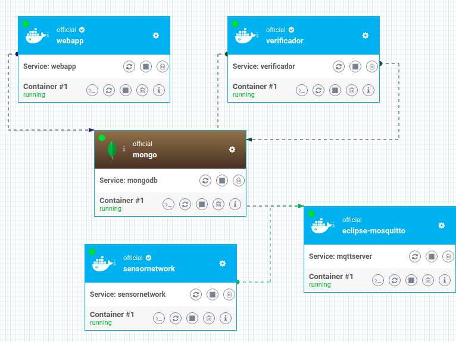
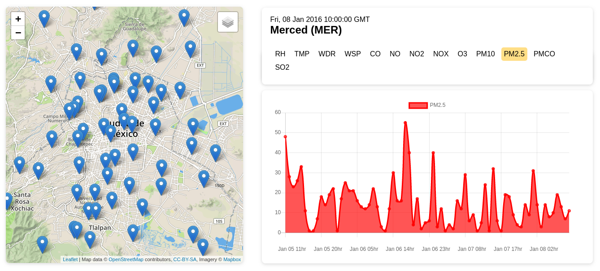

# Arquitectura de software orientada a microservicios para la recolección y tratamiento de variables ambientales
Arquitectura de software basada en microservicios para la recolección y tratamiento de datos relacionados con la contaminación del aire, obtenidos a través de una red de sensores.



## Introducción
Las aplicaciones de Internet de las Cosas (IoT) en el contexto del monitoreo ambiental son un componente clave para la industria y el desarrollo de ciudades inteligentes. Estas aplicaciones se benefician de los avances de la computación en la nube y el Big data para realizar un conjunto de tareas que van desde la recolección de datos provenientes de una red de sensores, hasta el procesamiento, análisis y presentación de los mismos.
Este tipo de aplicaciones requieren de una arquitectura que sea **distribuida, escalable, flexible y confiable.** Donde cada uno de los componentes sean independientes, puedan interactuar entre ellos y permitan un desarrollo continuo. Sin embargo, estas características son difíciles de conseguir con los sistemas monolíticos convencionales haciendo que su desarrollo sea lento y complejo. Por lo tanto, en este estudio se propone el desarrollo de una arquitectura de microservicios (en inglés, Micro Services Architecture, MSA), usando patrones orientados a este tipo de arquitectura.



 Fig. 1: IoT Architecture Layers and Components.


## Objetivo
* Crear y desarrollar una arquitectura de software orientada a microservicios para la recolección y tratamiento de variables ambientales, usando  contenedores virtuales.

## Desarrollo
La arquitectura de software propuesta se desarrolló a partir de la definición de los requerimientos para un software de recolección, tratamiento y análisis de variables ambientales enfocado en la medición de contaminantes y variables atmosféricas entre las cuales destacan la dirección y velocidad del viento, humedad relativa, partículas suspendidas, ozono, dióxido de carbono entre otras. Dichas medidas son recolectadas por una red de estaciones cada hora.

Siguiendo un patrón de microservicios se propuso la siguiente arquitectura compuesta de un API Gateway y una Interfaz gráfica de usuario (GUI) a la cual se unen un flujo de trabajo (workflow) y microservicios independientes. El workflow Data Collection está dedicado al extracción y procesamiento de los datos cuya capa de comunicación es un broker MQTT en la cual la red de sensores publica los datos a diferentes tópicos cuyos suscriptores son los servicios de validación, indexación que se encargan de almacenar los datos procesados a una base de datos noSQL. Además otros servicios independientes se encargan de realizar análisis estadístico, extraer datos históricos de otras fuentes y generar mapas con datos geoespaciales.


### Arquitectura propuesta


Para desarrollar cada uno de los microservicios se utilizó la tecnología de contenedores virtuales Docker en la que cada uno de los servicios se definieron usando un archivo Dockerfile y se integraron usando la utilidad de Docker Compose. la siguiente imagen muestra un ejemplo de la definición de la arquitectura por código.


### Ejemplo de integración de microservicios basados en contenedores virtuales con Dockerfile y Docker Compose.




El proceso de desarrollo de cada uno de los microservicios consiste en definir la comunicación entre el API Gateway u otro servicios y la capa de almacenamiento, esto implica declarar el formato de entrada y salida de los datos, después a través de un archivo Dockerfile se deben definir las dependencias, puertos, volúmenes de datos y comandos de ejecución, así como su interacción con otros microservicios por medio del archivo docker-compose.yml. La configuración varía dependiendo del entorno de ejecución. (desarrollo, pruebas o producción).

### Esquema de microservicios


En el diagrama anterior se pueden observar los microservicios en ejecución desplegados con Docker Compose. El servicio 'webapp' engloba las capas del API Gateway y GUI, el servicio 'verificador' compone el workflow 'Data Collection', el cual obtiene los datos de una red de sensores simulada con el servicio 'sensornetwork' a través de la capa de acceso representada por el servicio 'mqttserver' y los procesa para finalmente indexarlos en la base de datos presente en el servicio 'mongo'.
Al final los datos son presentados por medio de una interfaz web proporcionada por el servicio 'webapp'.

### Aplicación Web (GUI)


# Estructura del Proyecto
Cada microservicio esta desarrollado de manera independiente bajo la tecnologia de contenedores de Docker. cada directorio en el directorio raiz es un microservicio y dentro de cada uno se encuentra un folder app(donde se encuentra toda la base de codigo del microservicio) y un archivo Dockerfile(usado por docker-compose para levantar el servicio) en el cual se define el contenedor del servicio. En el folder raiz se encuentra el archivo docker-compose.yml el cual define la arquitectura de microservicios.

## Microservicios

### [**webapp**](webapp)
Aplicación web donde se presentan los datos recolectados por la red de sensores
### [**sensornetwork**](sensornetwork)
Microservicio que simula una red de sensores, utiliza datos historicos para simular la transmición continua de mediciones.
### [**sensorpublish**](sensorPublish)
Microservicio que simula la publicación de mediciones por un sensor
### [**verificador**](verificador)
Microservicio para la verificación y limpieza de las mediciones obtenidas desde la red de sensores
### [**stats-api**](stats-api)
Api para la obtencion de medidas de estadistica descriptiva, servicio independiente que no se concidera dentro de la arquitectura propuesta, debe de ejecutarse de manera independiente
### [**mongodb**](docker-compose.yml)
Base de datos MongoDB donde se alamcenan las mediciones recibidas desde la red de sensores
### [**mqttserver**](docker-compose.yml)
Brocker MQTT de mensajeria, permite la comunicación entre los servicios y la red de sensores


## Dependencias
El proyecto necesita Docker engine y Docke Compose para funcionar


* [Install Docker Community Engine](https://docs.docker.com/install/)
* [Install Docker Compose](https://docs.docker.com/compose/install/)

## Ejecutar
1. Clonar o descargar el proyecto
```
$ git clone https://github.com/edsonMR98/DockerProject.git
```
2. Dentro del proyecto usar docker compose para ejecutar la arquitectura de microservicios.
```
$ cd DockerProject
$ docker-compose up -d
```
3. Listar los servicios para comprobar que esten en ejecución y en que puerto estan expuestos.
```
$ docker-compose ps
```
4. Abrir el servicio webapp en tu navegador http://localhost:5000

5. Modificar archivo docker-compose.yml para configurar los puertos de cada servicio, si es necesario.


## Autores

* **Edson Moreno** - [edsonMR98](https://github.com/edsonMR98)
* **Alfonso Lechuga** - [lechugalf](https://github.com/lechugalf)
* **Leitza Jimenez** - [Leitzajmz](https://github.com/Leitzajmz)

## Reconocimiento

Proyecto desarrollado durante el [XXIV Verano de la Investigación Científica y Tecnológica del Pacífico 2019](https://www.programadelfin.org.mx/) realizado en el Centro de Investigación y de Estudios Avanzados del Instituto Politécnico Nacional (CINVESTAV) en la linea de investigación de Cómputo en la nube y Big Data


